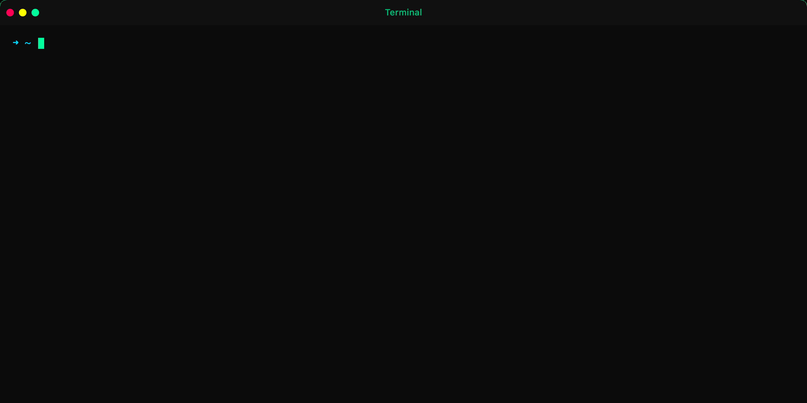
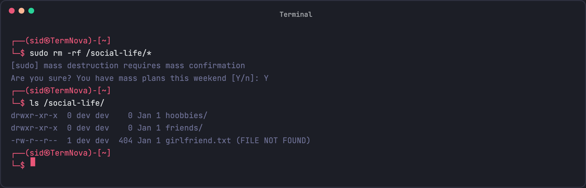
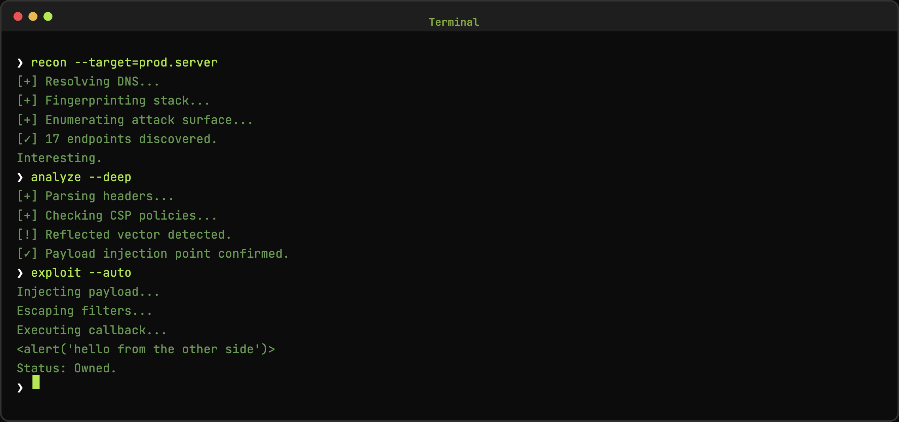

<div align="center">

# `TermNova`

**Turn boring terminal screenshots into eye-catching animated showcases**

[](https://dr34mhacks.github.io/TermNova/)
[](https://github.com/dr34mhacks/TermNova)
[](LICENSE)

</div>

---

## The Problem

Ever tried showcasing your CLI tool, security script, or terminal workflow? Static screenshots are boring. Screen recordings are bulky. And most GIF tools produce pixelated messes.

## The Solution

TermNova lets you create **beautiful, animated terminal GIFs** that look like the real thing - with realistic typing effects, instant command output, and professional themes. Perfect for GitHub READMEs, Twitter posts, documentation, and presentations.

**100% browser-based** - your data never leaves your machine.

---

## Features

- **Realistic Typing Animation** - Character-by-character typing effect
- **Instant Output** - Use `!!` markers for instant command results
- **12+ Themes** - Dracula, Nord, Matrix, Synthwave, and more
- **Export Options** - GIF, PNG, SVG
- **Resolution Presets** - Optimized for LinkedIn, Twitter, GitHub, Discord, YouTube
- **Fully Customizable** - Fonts, colors, window style, effects

---

## Screenshots

<div align="center">
<table>
<tr>
<td align="center">
<b>Gif</b><br>

</td>
<td align="center">
<b>Horizon</b><br>

</td>
<td align="center">
<b>Mr Robot</b><br>

</td>
</tr>
</table>
</div>

---

## Quick Start

```
> your-command --flags
!!
Command output appears instantly
!!
> next-command
```

- `>` prefix = command (typed with animation)
- `!!` markers = instant output block (hidden in final result)

---

## Development

```bash
git clone https://github.com/dr34mhacks/TermNova.git
cd TermNova
npm install
npm run dev
```

or just use `https://dr34mhacks.github.io/TermNova/`

---

## Acknowledgments

Built with [gifenc](https://github.com/mattdesl/gifenc) and [html2canvas](https://html2canvas.hertzen.com/). 

---

<div align="center">

**Made with lots of  ☕ by [@dr34mhacks](https://github.com/dr34mhacks)**

*No terminals were harmed in the making of this tool.*

</div>
